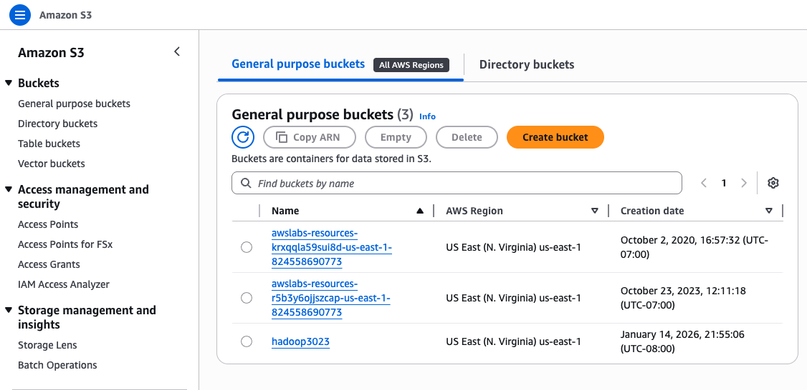

# aws-emr-hive-log-processing
# CloudFront Log Processing with AWS EMR (HiveQL) & Amazon S3

## Overview
This project demonstrates an end-to-end cloud data processing workflow on AWS to parse and analyze semi-structured CloudFront access logs using **Amazon EMR (Hadoop + Hive)**. The pipeline ingests raw logs from **Amazon S3**, converts them into a structured format via **Hive External Tables** + **RegexSerDe**, runs **HiveQL** aggregation queries, and writes query outputs back to S3 for downstream analytics.

---

## Objectives
- Process large-scale (semi-structured) web access logs in a distributed environment
- Build a structured schema in Hive for raw CloudFront logs
- Generate analytical insights (requests by operating system) using HiveQL
- Export query results back to S3

---

## Architecture
**S3 (Raw logs)** → **EMR Cluster (Hive parse + query)** → **S3 (Query outputs)**

- **Input**: CloudFront log files stored in Amazon S3  
- **Compute**: Amazon EMR Cluster (Hadoop ecosystem with Hive)
- **Processing**: Hive external table + RegexSerDe parsing + HiveQL aggregation
- **Output**: Query results written to Amazon S3 folder (`os_requests/`)

### S3 Bucket (Input/Output Storage)


---

## Tech Stack
- **AWS EMR** (Hadoop ecosystem cluster)
- **Apache Hive / HiveQL**
- **Amazon S3** (data lake storage: input + output)
- **RegexSerDe** for parsing log text files
- Distributed computing concepts: cluster-based execution, parallel processing

---

## Workflow

### 1) Provision EMR Cluster
- Created an EMR cluster with pre-installed applications:
  - Hadoop
  - Hive
  - Hue
  - Pig
  - (Spark/Zeppelin included by EMR stack)
- Verified cluster configuration and node availability

---

### 2) Run Hive Script as an EMR Step
- Added an EMR **Step** using *Hive program*
- Tested on EMR 5.36.1
- Configured:
  - **Hive script location (S3)**:  
    `s3://us-east-1.elasticmapreduce.samples/cloudfront/code/Hive_CloudFront.q`
  - **Input S3 location**:  
    `s3://us-east-1.elasticmapreduce.samples`
  - **Output S3 location**:  
    `s3://hadoop3023/os_requests/`
  - Optional arguments:  
    `-hiveconf hive.support.sql11.reserved.keywords=false`

Monitored step lifecycle: `Pending → Running → Completed`


---

### 3) Create Hive External Table (Schema Definition)
The Hive script creates an external table (e.g., `cloudfront_logs`) with structured columns such as:
- date, time, requestIP, method, uri, status
- OS, browser, browserVersion, etc.

---

### 4) Parse Logs with RegexSerDe
Used **RegexSerDe** to extract fields from raw log lines and map them into table columns.  
This enables SQL-like querying directly over text-based CloudFront logs.

---

### 5) Aggregate Results with HiveQL
Executed HiveQL to compute **request volume grouped by operating system** within a time window:

- Query outputs are written into the target S3 output directory using:
  `INSERT OVERWRITE DIRECTORY ...`

---

### 6) Validate Outputs in Amazon S3
Downloaded output result files (e.g., `000000_0`, `000001_0`) from:
- `s3://hadoop3023/os_requests/`
- Each output file is a plain text file with the format: <OS><TAB><request_count>

Validated results containing OS request counts:
Aggregated number of CloudFront access requests by OS:

| OS        | Requests |
|----------|----------|
| Linux    | 813      |
| MacOS    | 852      |
| OS X     | 799      |
| iOS      | 794      |
| Android  | 855      |
| Windows  | 883      |

---

## Why EMR + Hive?

Although this dataset sample is small, the same workflow scales to **millions of log records** by distributing processing across multiple nodes.

Key advantages:
- Hive enables SQL-like querying on large log files
- EMR provides scalable compute resources without managing servers manually
- S3 acts as both data lake storage and output destination

---

## Results
- Successfully processed CloudFront access logs via distributed Hive execution on EMR
- Produced structured output files in S3 containing aggregated metrics:
  **requests per operating system**

---

## Notes
- Do NOT commit any AWS credentials or `.pem` keypairs into this repo.
- Replace placeholders:
  - `<REGION>`
  - `<your-bucket>`

---

## Future Improvements
- Convert output to partitioned parquet format in S3 for faster query performance
- Add Athena/Glue catalog for serverless querying
- Automate pipeline using Airflow or AWS Step Functions

### HiveQL Query
```sql
SELECT
  os,
  COUNT(*) AS count
FROM cloudfront_logs
WHERE dateobject BETWEEN '2014-07-05' AND '2014-08-05'
GROUP BY os;

